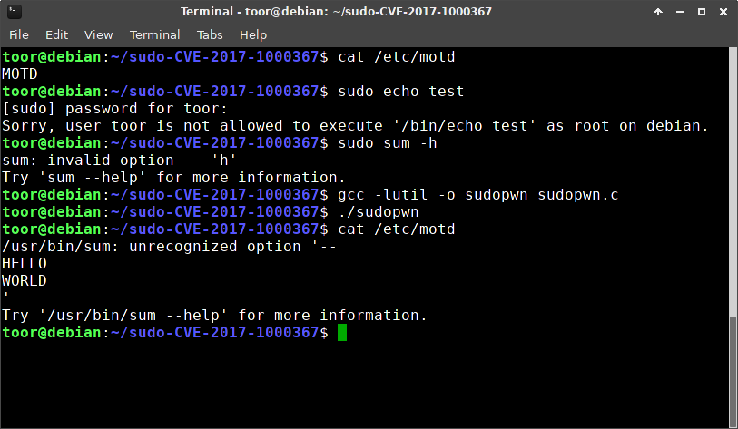

# sudo-CVE-2017-1000367

http://www.openwall.com/lists/oss-security/2017/05/30/16

- Compile: gcc -o sudopwn sudopwn.c -lutil
- Disclaimer: I had no clue what I was doing ;-)

## Requirements

- System must be selinux-enabled
- sudo needs to be built with selinux support (sudo -r)
- User needs to have sudo permissions e.g. "toor ALL=(ALL) NOPASSWD: /usr/bin/sum"

